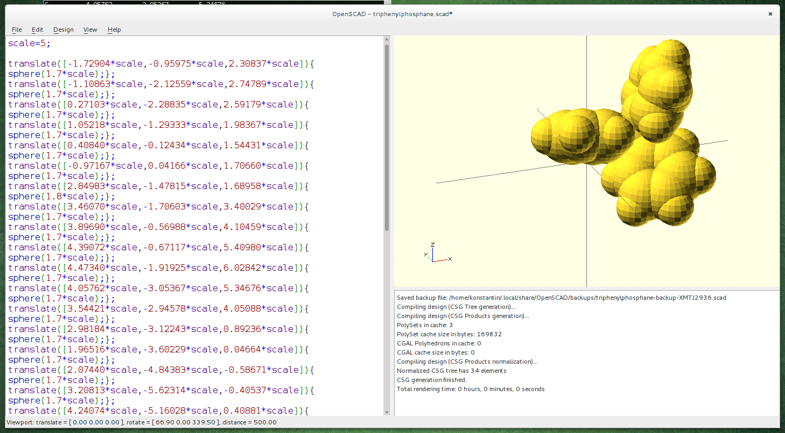

#xyz2openscad

##Description
A GNU Guile script for generating 3D open-scad molecule
models from .xyz files.
The script will print the open-scad source file to std-out.

##Usage
`guile xyz2openscad.scm <input-file> > <output-file>`

or

`./xyz2openscad.scm <input-file> > <output-file>`

(you need to make the script executable via chmod first of course)

This scripts supports piping the xyz file into it, which
makes it easy to use with open-babel.

The following example assumes you have a file called
"molecule.smi" which contains a smiles string for a molecule.

`obabel molecule.smi -o xyz --gen3d | guile xyz2openscad.scm > molecule.scad`

or

`obabel molecule.smi -o xyz --gen3d | ./xyz2openscad.scm > molecule.scad`

converts the smiles string to an xyz-file via open-babel, pipes the
result into the GNU Guile script, which generates an open-scad script
and saves it as "molecule.scad".

For the .xyz file specifications visit

http://en.wikipedia.org/wiki/XYZ_file_format

(the script essentially ignores the first two lines of input).

##Requirements
This script has been tested with GNU Guile 2.0.11.

##More information

The van der Waals radii of the atoms were taken from the web, so no
guarantee there. These can be expanded and/or changed easily, just
take a look at the script and the rest should be self-explaining.

Should the .xyz-file contain an atomtype for which the script contains no
data, a van der Waals radius of 1 Angstroem will be assumed. The atom will
also be colored red in the resulting open-scad script and there will
be a comment explaining things at the right location in the open-scad
script.